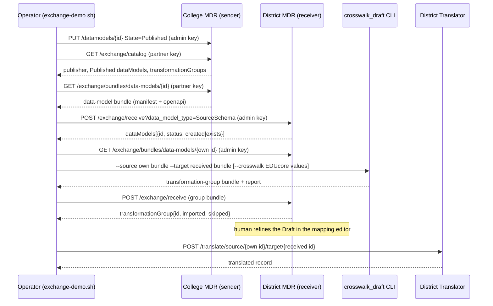

# Schema Exchange Between MDR Instances

Pull-based exchange of Published LIF data models and transformation groups between two MDRs (district ↔ community college), with EDUcore-seeded crosswalk drafts; prototype design, demo topology, and known gaps.

> Status: **prototype** (branch `feature/schema-exchange-demo`). Cross-cutting because it spans MDR, Translator, the `crosswalk_draft` brick, a compose override, and a demo script. Not an ADR — the one decision it leans on is already recorded in [ADR metadata_repository/0002](../adr/metadata_repository/0002-no-partner-management.md).

## Problem

A K-12 district and a community college each run LIF as containers (MDR API + Postgres + Translator). Each has its own OrgLIF model. Learners move between them, so each side needs the *other's* LIF model in its own MDR — to inspect it, to author mappings against it, and to translate records into it. Before this work the only path was the one ADR 0002 names: download the schema from the MDR UI and email it.

## What already existed

| Capability | Where |
|---|---|
| Data-model export/import and clone | `bases/lif/mdr_restapi/import_export_endpoints.py` (`GET /import_export/export/{id}`, `POST /import_export/import/`, `POST /import_export/clone/`), OpenAPI upload `POST /datamodels/open_api_schema/upload` in `datamodel_endpoints.py` |
| Portable transformation-group export/import (IDs ignored, paths resolved by `UniqueName`, `allowMissingPaths`, #772) | `bases/lif/mdr_restapi/transformation_endpoint.py` (`GET /{id}/export`, `POST /{id}/import`) |
| JSONata translator, used source→LIF by the orchestrator and LIF→external by Learner Data Export | `bases/lif/translator_restapi/core.py`, `components/lif/translator/`; see the brick README. Reverse *authoring* is still out of scope per [ADR mdr/0006](../adr/metadata_repository/0006-reverse-translation.md) |
| Service API keys (`X-API-Key`) with tenant routing for service principals | `components/lif/mdr_auth/core.py` |
| Developer keys for external callers (LDE) | [`operations/guides/lde-api-keys.md`](../../operations/guides/lde-api-keys.md); their long-term home is a control plane, not MDR — [ADR general/0002](../adr/general/0002-lif-control-plane-vs-mdr-host.md) |
| **No partner management**: MDR must not store other organizations' URLs or credentials | [ADR metadata_repository/0002](../adr/metadata_repository/0002-no-partner-management.md) |

## Exchange model

- **Sender publishes.** Only models whose `State == Published` (and groups whose source *and* target are Published) appear in `GET /exchange/catalog`; a bundle request for a non-Published model is a 409 (`components/lif/mdr_services/exchange_service.py`, `_get_published_data_model`).
- **Receiver pulls.** The receiving organization fetches a bundle and POSTs it to *its own* `POST /exchange/receive`. The sender never calls the receiver. In the demo the "pull" is `scripts/exchange-demo.sh` running on the host; in production it would be a partner's operator or job.
- **Read-only partner key.** The sender sets `MDR__AUTH__SERVICE_API_KEY__EXCHANGE_PARTNER`; `AuthMiddleware` maps it to the principal `service:exchange-partner-service` and rejects anything but `GET /exchange/*` with 403 (`_is_exchange_partner_allowed` in `components/lif/mdr_auth/core.py`). Unset means no partner key is registered — no fallback default (#1191).
- **How this respects ADR 0002.** ADR 0002 rejected MDR *storing* partner URLs and credentials because that is intrusive and MDR had no auth. Here MDR stores nothing about partners: the sender holds only its *own* key, the receiver holds nothing persistent (the key travels out-of-band and lives in the operator's environment), and there is no partner table, URL, or polling. The manual step ADR 0002 accepted (download → send → upload) is kept but made machine-checkable: a signed-off bundle with a checksum, pulled over HTTP instead of emailed.
- **Received models are `SourceSchema` by default.** OrgLIF/PartnerLIF models are defined by inclusions from a base model, which a bundled OpenAPI export does not carry, so `receive` creates the peer's model as a Draft `SourceSchema` (query `data_model_type` can override, but the prototype does not rebuild inclusions). See Gaps.
- **Publisher identity** comes from `MDR__EXCHANGE__PUBLISHER_NAME` (`components/lif/mdr_utils/config.py`, default `unnamed-mdr`; the demo compose sets "Lakeside Unified School District" and "Riverbend Community College").

## Demo flow

`--reverse` repeats everything after the publish step with the roles swapped (college pulls the district's model and translates through the college Translator).

## Bundle format (`formatVersion: "1"`)

Wire shapes live in `components/lif/mdr_dto/exchange_dto.py`; endpoints in `bases/lif/mdr_restapi/exchange_endpoints.py`. Auth is the normal MDR `X-API-Key` header.

| Endpoint | Key | Returns |
|---|---|---|
| `GET /exchange/catalog` | partner or admin | `{"publisher", "dataModels": [{id,name,version,type,state,description}], "transformationGroups": [{id,name,version,sourceDataModel:{id,name,version},targetDataModel:{...}}]}` — Published only |
| `GET /exchange/bundles/data-models/{id}` | partner or admin | `{"manifest": {kind:"data-model", formatVersion:"1", publisher, exportedAt, name, version, checksum:"sha256:..."}, "dataModel": {name,version,type,description,openapi}}` |
| `GET /exchange/bundles/transformation-groups/{id}` | partner or admin | `{"manifest": {kind:"transformation-group", ...}, "sourceDataModel": {...}, "targetDataModel": {...}, "transformationGroup": {<same JSON as /transformation_groups/{id}/export>}}` |
| `POST /exchange/receive?data_model_type=SourceSchema&contributor_organization=<opt>&allowMissingPaths=true` | admin (partner key is 403) | `{"dataModels": [{name,version,id,status:"created"\|"exists"}], "transformationGroup": {id,version,importedTransformationCount,skippedTransformationCount,skippedTransformations:[...]} \| null}` |

- `checksum` is `sha256` over the canonical JSON of the bundle without its `manifest`; a mismatch or unknown `formatVersion` is a 400.
- `receive` reuses a data model when a non-deleted `(Name, DataModelVersion, ContributorOrganization)` matches, else creates it. `contributor_organization` defaults to `manifest.publisher`. A group bundle resolves **both** of its models under that one value — which is why the demo script tags received models with the *receiver's* own org key (see the comment in `scripts/exchange-demo.sh`, `run_exchange`).
- A group bundle whose `(source, target, manifest.version)` already exists is a 409; editing an existing version through exchange is not supported.

## Crosswalk drafts and EDUcore

`components/lif/crosswalk_draft/` (CLI `scripts/generate-crosswalk-draft.py`) turns two data-model bundles (or raw OpenAPI files) into a *Draft* transformation-group bundle that `POST /exchange/receive` accepts. Matching is:

1. **Identity** — same `UniqueName` path on both sides becomes a pass-through JSONata mapping. This is what carries a LIF↔LIF draft.
2. **EDUcore crosswalk** (`--crosswalk reference_data/crosswalks/educore/*.json`) — value-level equivalences extracted from the EDUcore Education Standards Knowledge Graph, anchored on CEDS: two elements are equivalent when they point at the same CEDS `HubReference` (`EXACT_MATCH` authored, `CLOSE_MATCH` inferred with a 0–1 score).

What the graph held on 2026-09-03 (queried via the `educore-standards` MCP connector; also recorded in `reference_data/crosswalks/educore/README.md`):

| Standard | Property-level hub matches | Option-value hub matches |
|---|---|---|
| Ed-Fi | 918 `EXACT_MATCH` | 4,341 `EXACT_MATCH` |
| PESC | 586 `CLOSE_MATCH` (inferred from definition embeddings) | 0 |
| LIF 2.0 | **0** | 688 `CLOSE_MATCH` |

So EDUcore cannot yet propose **property** mappings to or from LIF; it contributes **value lookups** (the committed `edfi-to-lif.json`, 162 value rows across 7 LIF option sets, plus 68 *inferred* property rows: an Ed-Fi property and a LIF property whose option sets share CEDS value hubs) and Ed-Fi↔PESC property candidates. LIF↔LIF drafts therefore come from identity matching, and a human finishes them in the MDR mapping editor (`/explore/data-mappings/{groupId}`, `frontends/mdr-frontend/src/pages/Explore/Mappings/`), which already edits imported groups.

## Demo topology

`deployments/advisor-demo-docker/docker-compose.exchange.yml` layers a college side onto the existing stack (which plays the district):

| Role | Services | Host ports | Publisher |
|---|---|---|---|
| District (existing) | `lif-mdr-database`, `lif-mdr-database-restore`, `lif-mdr-api`, `lif-translator-org1` | MDR 8012, Postgres 5445, Translator 8007 | `MDR__EXCHANGE__PUBLISHER_NAME` (default "Lakeside Unified School District") |
| College (override) | `lif-mdr-database-college`, `lif-mdr-database-restore-college`, `lif-mdr-api-college`, `lif-translator-college`, `lif-mdr-app-college` | MDR 8022, Postgres 5446, Translator 8017, MDR app 5174 | `MDR__EXCHANGE__PUBLISHER_NAME_COLLEGE` (default "Riverbend Community College") |

Both MDRs restore the same seed (`projects/lif_mdr_database/backup.sql`, where id 17 is the OrgLIF "StateU LIF" and id 6 "Ed-Fi v5") and register the same `MDR__AUTH__SERVICE_API_KEY__EXCHANGE_PARTNER`, so one key pulls in either direction. The college is on its own network (`lif-net-college`); the exchange is driven from the host, so nothing crosses networks. `scripts/exchange-demo.sh` adopts the college's seeded copy of StateU LIF as "Riverbend CC LIF" (a rename via `PUT /datamodels/{id}`; `POST /import_export/clone/` currently fails, see below), publishes both, then runs the flow above (`--reverse` for both directions, `--dry-run` to print the curl calls).

## Seeing it in the UI

The district app (http://localhost:5173) shows the district MDR; the college app (http://localhost:5174, `lif-mdr-app-college`) shows the college MDR, including the Ed-Fi group. Same demo users and password on both. The college side has no Learner Data Export API, so its Export Playground page reports missing data formats.

The MDR app (`frontends/mdr-frontend`, http://localhost:5173, wired to the district MDR) is the only UI in the stack; the college has no app yet because the MDR URL is baked in at image build time.

- **Mapping editor** — `/explore/data-mappings/<group id>` shows the received Draft group as wires between the two models with the JSONata behind each wire; this is where the human edit happens. The demo prints the group id at step 5.
- **Export Playground** — `/export-playground` picks a demo persona (MDR `GET /demo/personas`) and an export format from the Learner Data Export API (`GET /available-data-formats`, every transformation group whose source is `OPENAPI_DATA_MODEL_ID` = StateU LIF), then shows `GET /exports` live. Once the district has received the "StateU LIF → Riverbend CC LIF" draft, "Riverbend CC LIF" appears as a format with no extra configuration. Requires `lif-learner-data-export-api` and its org1 query chain (see the header of `docker-compose.exchange.yml`); the app image already carries `LDE_API_URL` (`docker-compose.yml`, `lif-mdr-app` build args). LDE runs unauthenticated locally (`LDE_AUTH__API_KEYS` unset), so the app's bearer token is ignored. Verified 2026-09-03: persona 100005 (Matt Hanson) exported as Riverbend CC LIF through planner → cache → translator with the received draft group. With only the cache running the planner logs an orchestrator error and serves the seeded record; with `lif-orchestrator-api-org1`, Dagster, `lif-example-data-source-rest-api` and the org2/org3 GraphQL chains also up (see the compose header), the Dagster run completes in ~2s with all three adapters succeeding and a cold export takes ~10s. Starting Dagster without org2/org3 is worse than not starting it: each run retries the unreachable hosts for ~20s and the export trips its 30s planner timeout (`QUERY_PLANNER_CLIENT_TIMEOUT_SECONDS`).

## Ed-Fi source scenario (Northgate High School)

The LIF-to-LIF flow above matches by identity because both models descend from base LIF; EDUcore contributes
nothing to it (the group 32 report shows `crosswalkMatches: 0`). The scenario that actually exercises
"one side is on Ed-Fi, the other is not" is this one, run 2026-09-08 and re-run 2026-09-09 with real Ed-Fi
name elements:

1. **Northgate publishes an Ed-Fi schema.** The district uploads the MDR's Ed-Fi v5 model as
   `Northgate Ed-Fi v5` (SourceSchema, org `Northgate`, state Published) via
   `POST /datamodels/open_api_schema/upload` — `POST /import_export/clone/` was unusable until #1205, see gaps.
   The seeded model simplifies the Student: a single `Name` string, a `UniqueId`, and a
   `StudentIdentificationCode` entity carrying only the identification system. The Ed-Fi Data Standard (checked
   against the EDUcore Ed-Fi graph) has `FirstName` / `MiddleName` / `LastSurname` and `StudentUniqueId` on
   Student, and an identification-code common of `IdentificationCode` + `StudentIdentificationSystemDescriptor`
   + `AssigningOrganizationIdentificationCode`. The district aligns the published model through the public API:
   `uv run python scripts/align-edfi-student-model.py --mdr-url http://localhost:8012` adds the missing
   elements and retires `Student.Name` and `Student.UniqueId` (soft delete, which also removes transformations
   that referenced them). It is idempotent and targets the model named `Northgate Ed-Fi v5`.
2. **The college pulls it.** `GET /exchange/catalog` + `GET /exchange/bundles/data-models/{id}` on the
   district with the partner key; `POST /exchange/receive` on the college creates it as a SourceSchema.
   If the college already holds the model (same Name, Version and ContributorOrganization), `receive`
   reuses it *without* updating its attributes, so the same script must then run against the college too
   (`--mdr-url http://localhost:8022`); a re-pull under a different organization creates a duplicate model.
3. **The college includes `Person.Name.initials` in its profile.** Riverbend's LIF profile had only
   `firstName` / `lastName` under `Person.Name`; the 3:1 rule below needs a target, so the college adds one
   inclusion (`POST /inclusions/` with `ExtDataModelId` = its OrgLIF id, `ElementType: Attribute`,
   `IncludedElementId` = the base `Person.Name.initials` attribute, `LevelOfAccess: Public`).
4. **The college drafts the mapping** with `scripts/generate-crosswalk-draft.py`, source = the received
   Ed-Fi bundle, target = its own `Riverbend CC LIF` bundle, `--crosswalk
   reference_data/crosswalks/educore/edfi-to-lif.json`, and two `--authored` files in this order:
   `reference_data/samples/northgate-edfi-name-rules.json` (three demo rules for the real name elements:
   `firstName` and `lastName` as direct copies, `initials` built from `FirstName` + `MiddleName` +
   `LastSurname`) and `reference_data/transformations/Ed-Fi-v5_StateU-LIF__v1.0.json` (the LIF team's
   hand-written Ed-Fi rules, re-pointed by `UniqueName`). The first file listed wins a contested target, so the
   reference rules that split `Student.Name` are reported as `target already mapped` and drop out. Every rule
   carries its provenance in `Alignment`; a rule's own `Notes` (the initials rule's lossy-surname caveat, for
   example) travel with it, and rules without Notes get `seeded from authored rule '<name>'`. A `--notes`
   overlay (`reference_data/samples/northgate-edfi-rule-notes.json`, keyed by target path) then gives every
   rule a human note — what a direct copy copies, which Ed-Fi descriptor is passed through verbatim, and `REVIEW`
   flags on inherited rules that look wrong (`Address.Period` copied as a date, `StudentIdentificationSystem`
   landing on `Identifier.identifier`) — plus attribute-level notes such as MiddleName being optional. Authored
   rules take the note verbatim; the EDUcore row keeps its provenance text and gets the note appended. The
   result is that all 29 imported rules have a rationale in `Notes`, visible in the export, the single-rule
   view, and the flat list the Translator reads.
5. **The college receives the draft** — `receive` resolves the bundle's `Riverbend CC LIF` to the college's
   own OrgLIF model (the native-model fallback, see below) and imports 29 rules as group version 0.1.
   Re-drafting the same version means deleting the existing draft group first (`DELETE
   /transformation_groups/{id}`); `receive` refuses to edit an existing version.
6. **An Ed-Fi record is translated**: `POST /translate/source/{northgate}/target/{riverbend}` on the college
   translator with `reference_data/samples/northgate-edfi-v5-student.json` returns a Riverbend CC LIF
   `Person` with `Name: [{firstName: "Jordan", initials: "JAR", lastName: "Rivera"}]`, address/email/phone,
   the course, and `addressState: "Georgia"` produced by the EDUcore `GA -> Georgia` lookup.

Provenance of the 29 rules that landed:

| Alignment | Rules | Where it came from |
|---|---|---|
| `educore:VALUE_SET_EQUIVALENCE:0.872` | 1 | `Address.StateAbbreviation -> addressState`, inferred because the two option sets share 61 CEDS value hubs; carries a 61-entry `$lookup` |
| `lif-authored` | 3 | `northgate-edfi-name-rules.json`: `FirstName -> firstName`, `LastSurname -> lastName`, and the 3:1 `initials` rule |
| `lif-authored` | 25 | reference Ed-Fi rules whose target exists in the college's model |
| `identity` | 0 | Ed-Fi and LIF share no attribute names |

58 of the 83 reference rules did not land: 53 target fields the college's LIF profile does not include
(`Assessment.shortName`, `Person.Birth.*`, `Person.Demographics.highestLevelEducation`,
`Course.courseApplicableEducationLevel`, ...), 2 lost the `firstName` / `lastName` targets to the name-rules
file, 1 collided with the EDUcore row, and 2 reference the malformed `{Multiple}` entity. EDUcore's other
inferred property rows (`LevelOfEducation`, `GradeLevel`, `Sex`) point at those absent fields, so only the
state-code row applied.

**The export direction (Renee in the Export Playground).** The MDR frontend's Export Playground lists the
six demo learners and offers, as target formats, every transformation group whose *source* is the deployment's
own LIF model (the LDE's `OPENAPI_DATA_MODEL_ID`, StateU LIF id 17 on the district). It therefore showed
`Northgate High School LIF` and `Riverbend CC LIF` but not Ed-Fi until a group `StateU LIF -> Northgate Ed-Fi v5`
existed on the district. That group is drafted the same way, in reverse: source = the district's own StateU LIF
bundle, target = its published `Northgate Ed-Fi v5` bundle, `--authored
reference_data/samples/northgate-edfi-export-rules.json` then `--authored
reference_data/transformations/StateU-LIF_Ed-Fi-v5-v1.0__v1.0.json`, `--notes
reference_data/samples/northgate-edfi-export-rule-notes.json`, received on the district with
`contributor_organization=Northgate` (StateU LIF resolves through the native-model fallback). The four demo rules
cover the Student identity elements; 27 of the 70 reference rules land beside them, the rest read LIF fields
outside StateU's profile (`Organization.*`, `Person.Culture.*`, `Person.Residency.*`, ...) or target the retired
`Student.Name` / `Student.UniqueId`. The LDE then lists `Northgate Ed-Fi v5` and `GET /exports` for Renee
(learner `100004`) returns `Student: {FirstName: "Renee", LastSurname: "Green", StudentUniqueId: "100004"}`
and `StudentIdentificationCode` as a list of paired objects, plus `Address`, `ElectronicMail`, `Telephone` and
`IdentificationDocument` blocks. No EDUcore lookup is applied to the address in this direction yet, so
`addressState` values such as `Georgia` are copied into the two-letter `StateAbbreviation` slot verbatim
(flagged `REVIEW` in the notes).

**Why the identifier rules are entity-level.** The reference file mapped `Person.Identifier.identifier` and
`Person.Identifier.identifierType` with two independent attribute rules. Each flattens the `Identifier` array on
its own, so a learner with two identifiers exported as two parallel arrays whose only link was position — the
pairing that is explicit in the LIF record became implicit in the output. The replacement is one rule per
repeating entity: `Person.Identifier.{ IdentificationCode, StudentIdentificationSystem, AssigningOrganizationIdentificationCode }` emits one Ed-Fi object per LIF row, and `StudentUniqueId` selects
the single school-assigned identifier instead of copying all of them. The same rule applies to any two
attribute rules that iterate the same source array; the mapping's `Notes` record it on both rules.

**How the mapping is visible in the API.** `GET /transformation_groups/{id}/export` is the portable file
(UniqueName paths, the same shape `--authored` consumes); `GET /transformation_groups/transformations/{id}`
is one rule with numeric paths, for the UI; `GET /transformation_groups/transformations_for_data_models/`
(`source_data_model_id`, `target_data_model_id`) is the flat list the Translator pulls at translate time, and
it carries each rule's `Alignment` and `Notes`. The translated record itself carries no trace of which rule
produced a field.

**What this makes accurate to claim.** A K-12 system on Ed-Fi and a college on its own LIF model exchanged
a learner record with neither changing its schema: the district published its schema, the college drafted
the mapping, and the translation ran on the college side. EDUcore supplied the value crosswalk and the
value-set-inferred property match it currently has for LIF; the bulk of the field mapping is LIF-authored.
It is **not** accurate to say the mapping is EDUcore-derived until EDUcore anchors LIF properties to CEDS
(0 property-level LIF matches on 2026-09-08 — see `reference_data/crosswalks/educore/README.md`).

## Gaps / follow-ups

- **Soft-deleting a received SourceSchema model can soft-delete an unrelated OrgLIF's inclusions.** Observed
  2026-09-09 on the college MDR: receiving a transformation-group bundle under a new organization created a
  duplicate `Northgate Ed-Fi v5` copy; `DELETE /datamodels/{id}` on that copy left 4 `Riverbend CC LIF`
  attribute inclusions (`Course.name`, `Course.identifier`, `Course.courseBeginDate`, `Course.courseEndDate`)
  with `Deleted = true`, silently shrinking the college's export until they were restored by hand.
  `soft_delete_entity` step 5 matches `ExtInclusionsFromBaseDM.IncludedElementId == entity id` without an
  `ElementType` filter, so an *attribute* inclusion whose attribute id equals a deleted entity's id is hit.
- **PESC output needs a JSON→XML step.** The Translator emits JSON only (`bases/lif/translator_restapi/core.py`); a college that wants PESC XML transcripts needs a serializer after translation. EDUcore's Ed-Fi↔PESC property candidates (not yet committed; Cypher in `reference_data/crosswalks/educore/README.md`) would seed that mapping.
- **Received models are `SourceSchema`, not `PartnerLIF`.** The bundle carries an OpenAPI export, not the inclusion list that defines an Org/Partner LIF model, so a peer's LIF appears in the MDR as a source schema. Rebuilding inclusions from a bundle (or adding them to the format) is open.
- **Tenant is caller-asserted for service keys.** A service principal may set `X-API-Tenant-Schema` and MDR trusts it (`components/lif/mdr_auth/core.py`, `resolve_tenant_schema`). The partner key is confined to `GET /exchange/*`, but on a multi-tenant MDR it can still read any tenant's Published catalog.
- **The Translator has no inbound auth** (`bases/lif/translator_restapi/core.py` mounts no middleware); the demo relies on the compose network.
- **Partner key issuance** is a static env var today. It should become a developer key issued/revoked by the control plane described in [ADR general/0002](../adr/general/0002-lif-control-plane-vs-mdr-host.md), scoped read-only to `/exchange`.
- **Group bundles resolve both models under one `contributor_organization`.** Fine for the demo (the script tags received models with the receiver's org key) but awkward when a partner's model was received under the partner's name; `receive` could instead look each model up by `(Name, Version)` with the publisher as a tiebreaker.
- **`POST /import_export/clone/` returns 500** on the seeded MDR: `clone_datamodel` (`components/lif/mdr_services/import_export_service.py`) calls `check_unique_data_model_exists` with two arguments but the function now takes four (`TypeError`, observed 2026-09-03). The demo works around it by renaming the seeded copy. Pre-existing bug, not fixed on this branch. Separately, clone sets `BaseDataModelId` to the *source* model rather than base LIF (id 1).
- **No UI.** Catalog browsing, pull, and receive are API/script only; the mapping editor already handles the resulting Draft groups.
- **Windows checkouts break two Docker images.** `projects/mongodb/entrypoint.sh`, `projects/lif_query_planner_api/entrypoint.sh` and `projects/dagster_docker_compose/code_location_entrypoint.sh` are checked out CRLF under `core.autocrlf=true` and copied verbatim into the images; the planner container then exits (`exec entrypoint.sh: no such file`) and mongodb skips seeding. A `.gitattributes` pinning `*.sh` to LF is the durable fix (flagged as a follow-up task); until then convert the two files locally before building.
- **Run end-to-end on 2026-09-03** against two local stacks (`docker-compose.exchange.yml`), both directions. Each direction: catalog pulled with the partner key, the peer's OrgLIF received as a SourceSchema, a Draft group generated with 259 identity matches (0 unmatched on either side), received with 197 transformations imported and 62 skipped, and a sample learner translated through the receiving translator. All 62 skips are StateU's org-extension entities (`Person.PositionPreferences`, `Person.Interactions`, `Person.Narrative`, `Person.EmploymentPreferences`, `RemunerationPackage.Ranges`, `Credential.Image`): their associations are flagged as extensions, which a received SourceSchema copy cannot chain (the PartnerLIF gap above). Every base-LIF attribute imported.
- **`receive` matches models by (Name, Version, org), then by (Name, Version) among the receiver's own
  native models** (BaseLIF/OrgLIF/PartnerLIF). Without the fallback, a group drafted by a peer against the
  receiver's published model spawned a duplicate SourceSchema copy and the group pointed at the copy
  (observed 2026-09-08). Same-named SourceSchema copies from two peers still stay separate.
- **`POST /import_export/clone/` returns 500** (`check_unique_data_model_exists()` called with two of four
  arguments). The Ed-Fi scenario publishes via the OpenAPI upload endpoint instead.
- **Identity sequences fall behind after a `backup.sql` restore**: `DataModels_Id_seq` was at 28 while the
  table held id 29 on both MDRs, so the next insert failed with a duplicate key. Reset with
  `setval(pg_get_serial_sequence(...), max("Id") + 1, false)` per identity column; the restore should do this.
- **Translator merge with list-valued roots is lossy**: the reference Ed-Fi rules map `Course.` onto the
  `Person` root, so a record with two `Course` rows makes JSONata emit a list-valued `Person` fragment and
  sibling fields placed by earlier fragments (e.g. `addressState`) vanish from the result, while the
  translator still reports `applied=28 discarded=0`. The committed sample carries one course.
